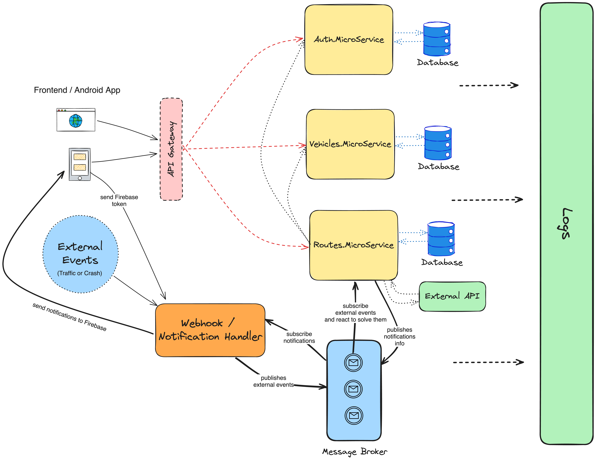

# Ocelot API Gateway

[](https://hub.docker.com/r/duartefernandes/ocelot-api-gateway)
[](https://hub.docker.com/r/duartefernandes/ocelot-api-gateway)
[](https://hub.docker.com/r/duartefernandes/ocelot-api-gateway)
[](https://hub.docker.com/r/duartefernandes/ocelot-api-gateway)

This project is an implementation of an API Gateway using the Ocelot library. The API Gateway provides a single entry point for client applications and routes requests to appropriate microservices. It also handles tasks such as authentication and load balancing.

For seeding instructions, please check the [Running the Seed Script](#running-the-seed-script) section.

This API Gateway is part of a larger project that includes other microservices. The other components of the project can be found at the following links:

- [Auth.MicroService](https://github.com/duartefernandes/Auth.MicroService)
- [Vehicles.MicroService](https://github.com/duartefernandes/Vehicles.MicroService)
- [Routes.MicroService](https://github.com/Rafa26Azevedo/Routes.MicroService)
- [ExternalEventHandler](https://github.com/MEI-Grupo-4-CarIn/ExternalEventHandler)

## System Architecture



## Setup (with Docker)

1. Clone the repository to your local machine.

2. Rename the `.env.example` file to `.env` and replace the placeholder values with your actual data. Here's what each environment variable is used for:

   - `SQL_SERVER_CONNECTION_STRING`: The connection string for your SQL Server database.
   - `SA_PASSWORD`: The password for the 'sa' user in your SQL Server database.
   - `MONGO_INITDB_ROOT_USERNAME`: The root username for your MongoDB database.
   - `MONGO_INITDB_ROOT_PASSWORD`: The root password for your MongoDB database.
   - `MONGO_URI_ROUTES`: The MongoDB URI for the routes microservice.
   - `MONGO_URI_VEHICLES`: The MongoDB URI for the vehicles microservice.
   - `MONGO_URI_NOTIFICATIONS`: The MongoDB URI for the event-notifications handler.
   - `OPENROUTESERVICE_API_URL`: The URL for the OpenRouteService API.
   - `OPENROUTESERVICE_API_KEY`: Your OpenRouteService API key.
   - `VEHICLE_MICROSERVICE_API_URL`: The URL for the vehicles microservice.
   - `AUTH_MICROSERVICE_API_URL`: The URL for the authentication microservice.
   - `JWT_PUBLIC_KEY`: Your JWT public key.
   - `SERVICE_SECRET_KEY`: Your service secret key.
   - `SMTP_PASSWORD`: Your SMTP password.
   - `ELASTICSEARCH_HOST`: The Elasticsearch host.
   - `RABBITMQ_URI`: The base URL of your _RabbitMQ_ instance.
   - `FIREBASE_SERVICE_ACCOUNT_KEY`: The firebase servide account key to use on `firebase-admin`.

3. Navigate to `compose_project` folder and run the Docker Compose file to start all the services:

   ```bash
   docker-compose up -d
   ```

This will start all the microservices defined in the `docker-compose.yml` file, including the Ocelot API Gateway. You can then access the API Gateway at the specified host and port.

## Running the Seed Script

To run the seed script, you need to execute the command within the `ocelot-api-gateway` container. Follow these steps:

1. **Start your services** (if not already running).
2. **Access the `ocelot-api-gateway` container and open the bash shell** (wait for process to finish):

   ```bash
   npm run seed
   ```

## Disclaimer

This project is part of a master's degree project and is intended for educational purposes only. It should not be used in production without further development and testing.
